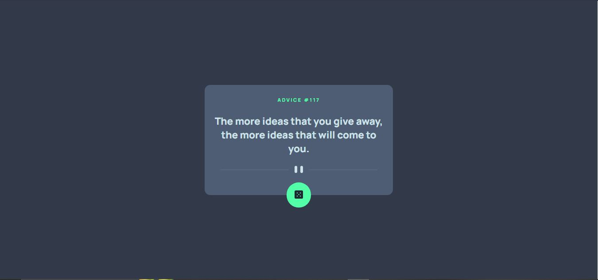
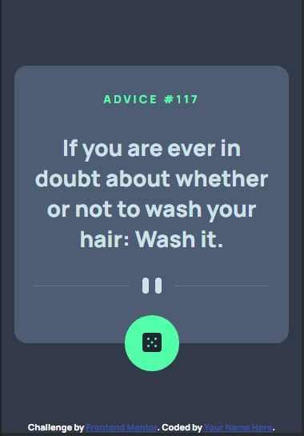

# Frontend Mentor - Advice generator app solution

This is a solution to the [Advice generator app challenge on Frontend Mentor](https://www.frontendmentor.io/challenges/advice-generator-app-QdUG-13db). Frontend Mentor challenges help you improve your coding skills by building realistic projects.

## Table of contents

- [Overview](#overview)
  - [The challenge](#the-challenge)
  - [Screenshot](#screenshot)
  - [Links](#links)
- [My process](#my-process)
  - [Built with](#built-with)
  - [What I learned](#what-i-learned)
  - [Continued development](#continued-development)
  - [Useful resources](#useful-resources)
- [Author](#author)
- [Acknowledgments](#acknowledgments)

**Note: Delete this note and update the table of contents based on what sections you keep.**

## Overview

### The challenge

Users should be able to:

- View the optimal layout for the app depending on their device's screen size
- See hover states for all interactive elements on the page
- Generate a new piece of advice by clicking the dice icon

### Screenshot




### Links

- Solution URL: [Add solution URL here](https://github.com/HillaryWebb-coder/advice-generator)
- Live Site URL: [Add live site URL here](https://hillary-advice-generator.netlify.app/)

## My process

### Built with

- Semantic HTML5 markup
- CSS custom properties
- Flexbox
- Vanilla JS
- Fetch API

### What I learned

I was able to learn how to absolutely position an element while keeping it in the center using flex while trying to create the pause icon with svg

```html
<div class="pause">
  <svg
    width="295"
    height="16"
    xmlns="http://www.w3.org/2000/svg"
    class="mobile-divider"
  >
    <g fill="none" fill-rule="evenodd">
      <path fill="#4F5D74" d="M0 8h122v1H0zM173 8h122v1H173z" />
      <g transform="translate(138)" fill="#CEE3E9">
        <rect width="6" height="16" rx="3" />
        <rect x="14" width="6" height="16" rx="3" />
      </g>
    </g>
  </svg>
  <svg
    width="444"
    height="16"
    xmlns="http://www.w3.org/2000/svg"
    class="desktop-divider"
  >
    <g fill="none" fill-rule="evenodd">
      <path fill="#4F5D74" d="M0 8h196v1H0zM248 8h196v1H248z" />
      <g transform="translate(212)" fill="#CEE3E9">
        <rect width="6" height="16" rx="3" />
        <rect x="14" width="6" height="16" rx="3" />
      </g>
    </g>
  </svg>
  <div class="pause-icon">
    <span class="bar"></span>
    <span class="bar"></span>
  </div>
</div>
```

```css
.pause {
  position: relative;
  display: flex;
  justify-content: center;
  align-items: center;
}
```

```css
.pause-icon {
  display: flex;
  gap: 8px;
  background-color: hsl(217, 19%, 38%);
  position: absolute;
  padding: 16px;
}
```

## Author

- Website - [Ogieleguea Hillary](https://github.com/hillarywebb-coder)
- Frontend Mentor - [@HillaryWebb-coder](https://www.frontendmentor.io/profile/HillaryWebb-coder)
- Twitter - [@OgielegueaH](https://www.twitter.com/OgielegueaH)
